# SIMDIK Al Insyirah — Architecture diagrams

Visual reference for the school tuition payment backend (Laravel + Midtrans). All diagrams use [Mermaid](https://mermaid.js.org/), which renders natively on GitHub, GitLab, Notion, and most markdown viewers and editors (VS Code with the Mermaid extension, Obsidian, etc.).

---

## 1. Tuition payment flow (overview)

End-to-end path from invoice creation to confirmed payment. Covers both single-invoice and bundle (multi-invoice / annual prepayment) paths. Both converge at the same `BundlePaymentService` for Midtrans charge creation.

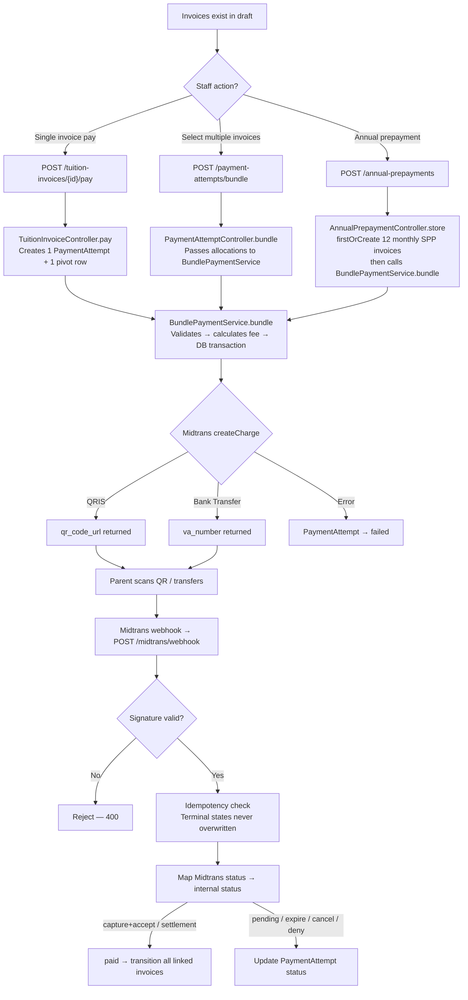

## 2. Database schema

Core tables and relationships. The many-to-many link between invoices and payment attempts is what powers bundled payments (multiple months, or a full annual prepayment, with QRIS or BSI Bank Transfer).

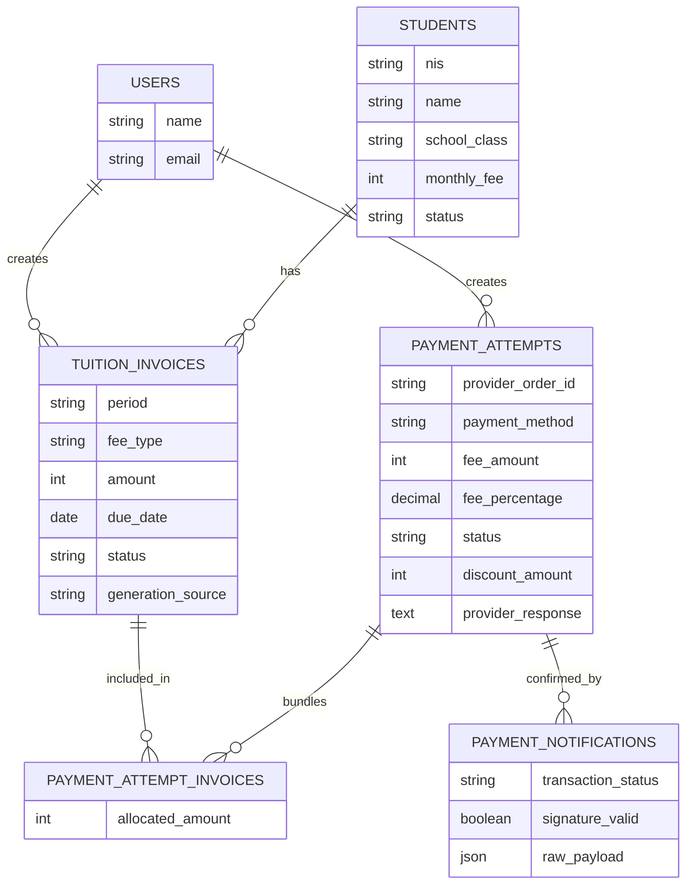

## 3. API surface structure

What's reachable without a token versus what sits behind Sanctum auth.

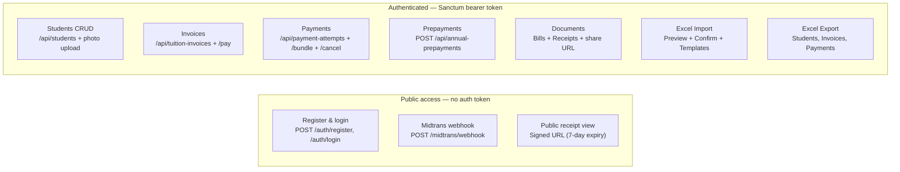

## 4. Frontend integration sequence

The call sequence a frontend client needs to follow, including the part that trips people up: the Midtrans webhook talks to the backend directly (same as before, works for both QRIS and Bank Transfer), never to the frontend, so the frontend has to poll for the final status.

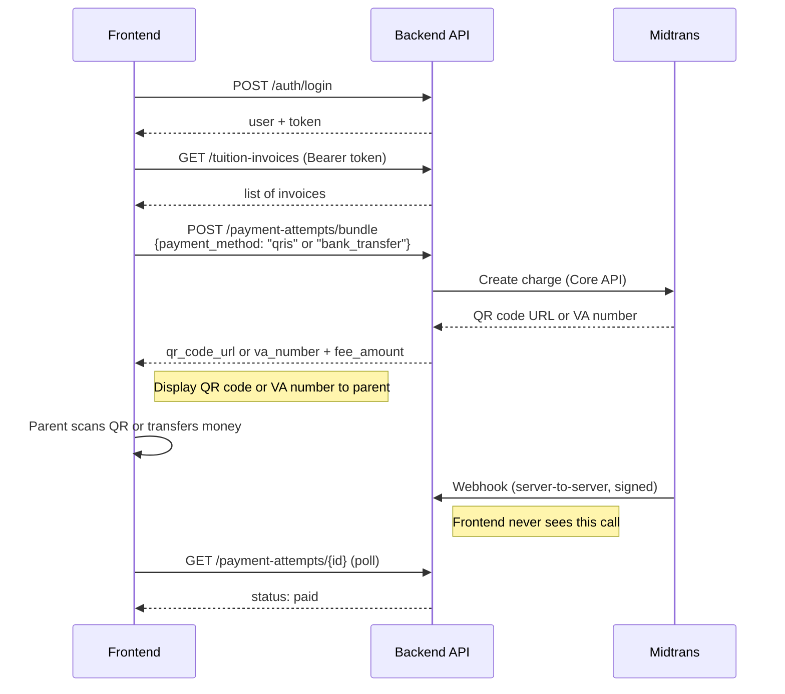

---

## 5. Annual prepayment flow

Staff generates all 12 monthly SPP invoices for a student's year in one action, then bundles them into a single Midtrans Payment Link. Invoices are created with `firstOrCreate` so re-submissions are idempotent.

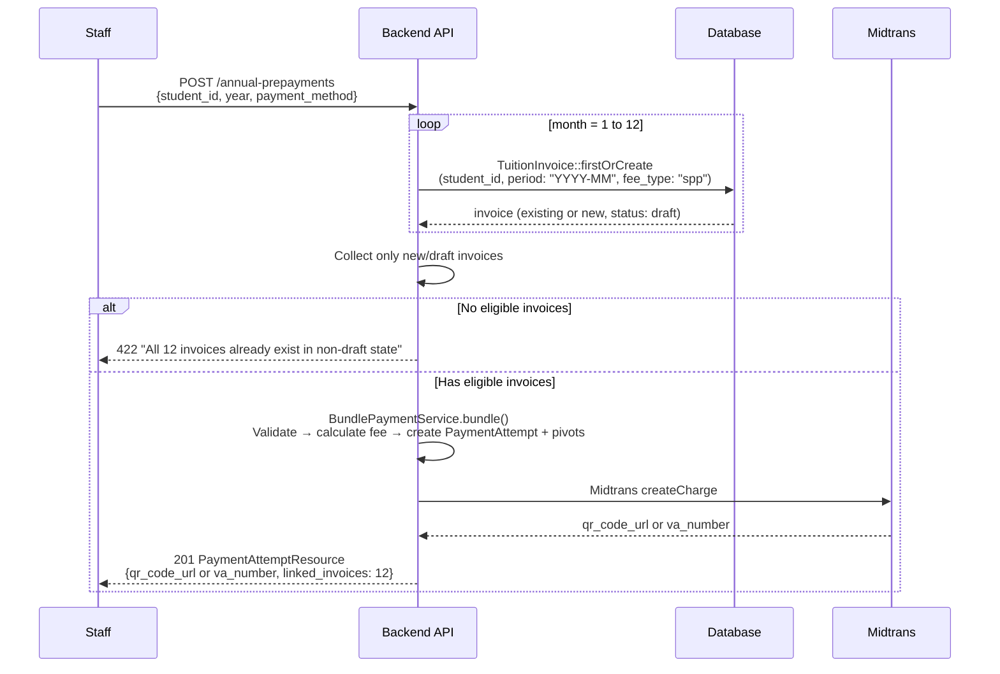

## 6. Bundle payment flow (multi-invoice)

Staff selects any mix of invoices across students/periods and pays them with a single QR code or VA number. Each invoice gets a separate `allocated_amount` in the pivot table.

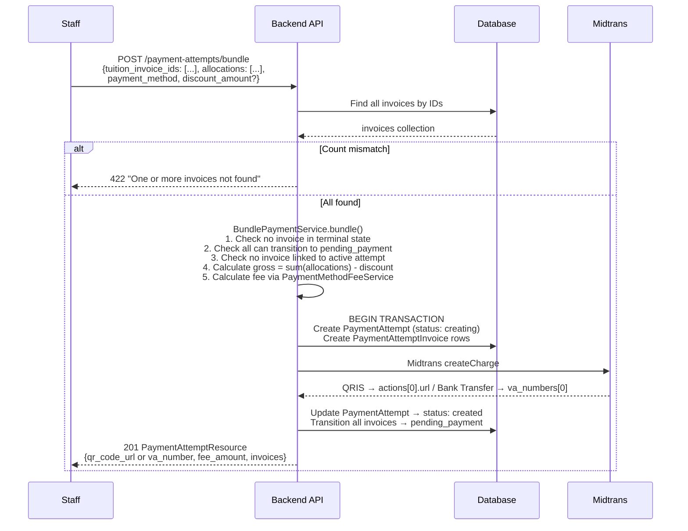

## 7. Payment cancellation flow

Staff cancels a non-paid PaymentAttempt. The handling differs by invoice origin: annual prepayment invoices are deleted permanently to prevent pile-up; manual/scheduled invoices revert to draft so they can be paid later.

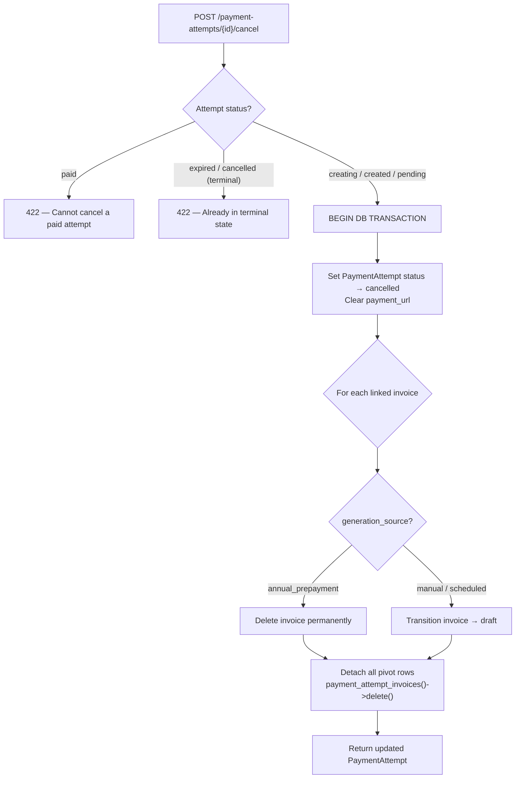

## 8. Student management flow

Full CRUD with photo upload to cloud storage. Photo endpoints are throttled to prevent abuse.

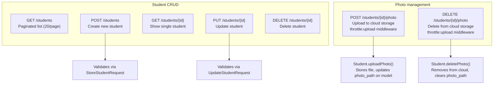

## 9. Excel import flow (two-step)

A preview-first import pattern prevents accidental data corruption. Step 1 parses the file without writing to the database. Step 2 uses a cached token to run the actual import.

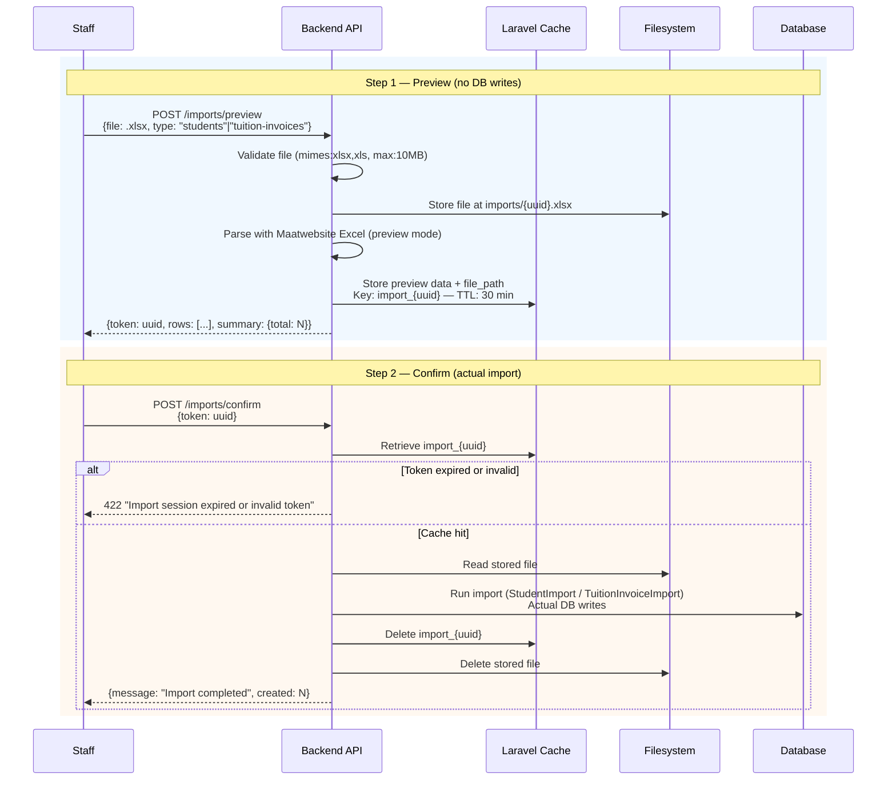

### Template downloads

| Endpoint | Description |
|---|---|
| `GET /imports/template/students` | Returns `template-students.xlsx` for staff to fill |
| `GET /imports/template/tuition-invoices` | Returns `template-tuition-invoices.xlsx` for staff to fill |

## 10. Excel export flow

Filtered exports to `.xlsx` files. All three export types share the same endpoint pattern with a `{type}` parameter.

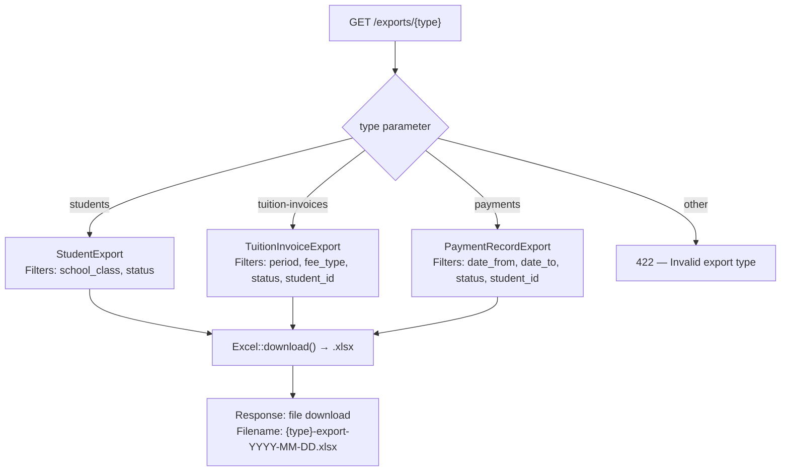

### Export filters by type

| Export | Filters |
|---|---|
| `students` | `school_class` — class name, `status` — active/inactive |
| `tuition-invoices` | `period` — YYYY-MM, `fee_type`, `status`, `student_id` |
| `payments` | `date_from`, `date_to` — date range, `status`, `student_id` |

## 11. Document generation flow

Bills and receipts can be viewed as HTML or downloaded as PDFs. Receipts also have a temporary public share URL (7-day expiry via signed route).

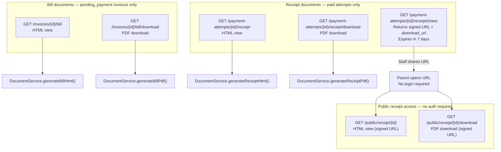

### Document status guards

| Document | Required status | HTTP error if wrong |
|---|---|---|
| Bill (HTML + PDF) | `pending_payment` | 404 |
| Receipt (HTML + PDF) | `paid` | 404 |
| Share URL | `paid` | 404 |

## 12. Authentication flow

Sanctum personal access tokens (not SPA cookie auth). Every authenticated request uses `Authorization: Bearer {token}`.

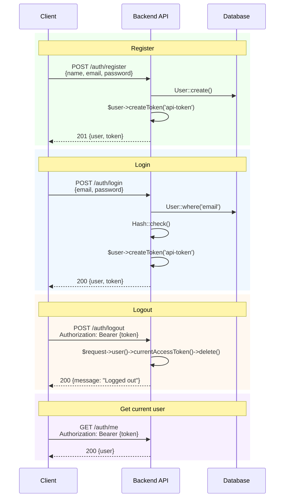

## 13. Webhook processing flow (enhanced)

Midtrans sends a server-to-server notification when a payment status changes. The backend verifies the signature, records the notification, maps the status, and processes all linked invoices in a single DB transaction.

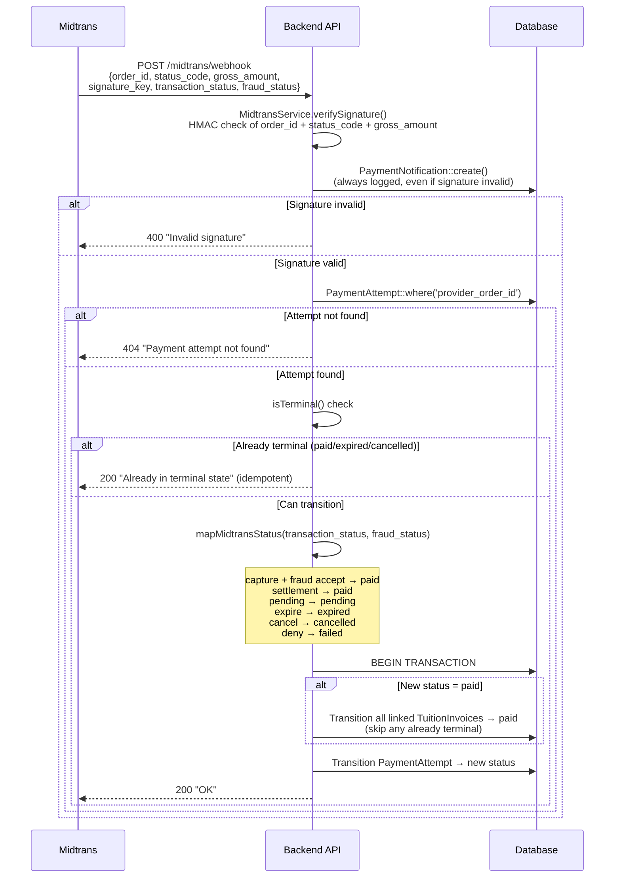

### Midtrans status mapping

| `transaction_status` | `fraud_status` | Internal status |
|---|---|---|
| `capture` | `accept` | `paid` |
| `settlement` | *(any)* | `paid` |
| `pending` | *(any)* | `pending` |
| `expire` | *(any)* | `expired` |
| `cancel` | *(any)* | `cancelled` |
| `deny` | *(any)* | `failed` |

## 14. Scheduled invoice generation

A monthly Artisan command runs via the Laravel scheduler to auto-generate SPP invoices for all active students. Uses `firstOrCreate` so re-runs are idempotent.

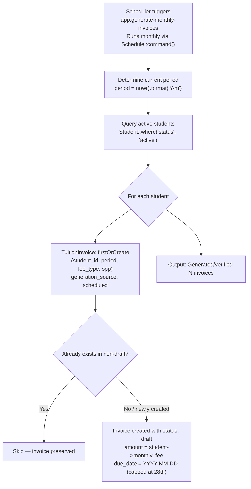

### Command reference

```bash
# Run manually (e.g. for testing or backfill)
php artisan app:generate-monthly-invoices

# Automatic schedule — runs on the 1st of every month
Schedule::command(GenerateMonthlyInvoices::class)->monthly();
```
