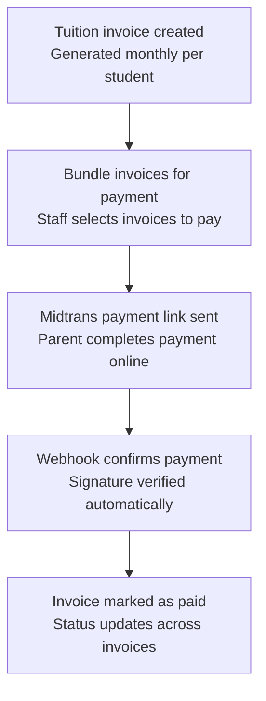
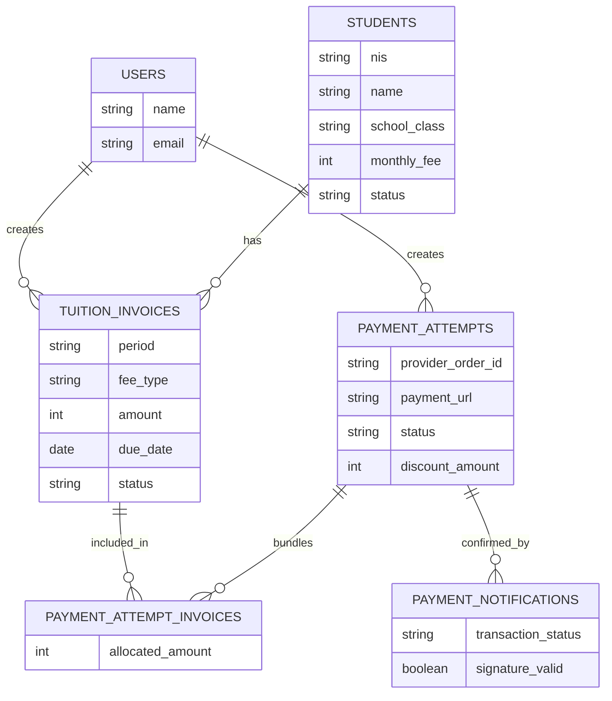
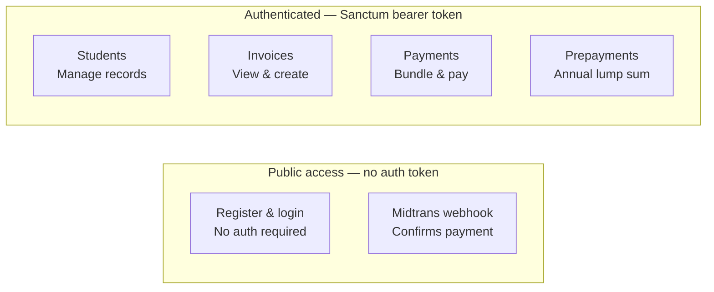
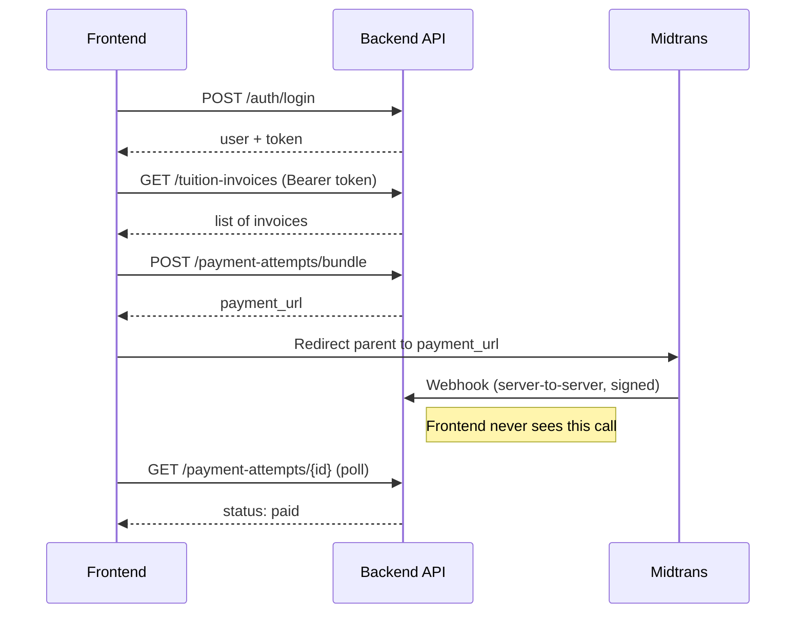

# SIMDIK Al Insyirah — Architecture diagrams

Visual reference for the school tuition payment backend (Laravel + Midtrans). All diagrams use [Mermaid](https://mermaid.js.org/), which renders natively on GitHub, GitLab, Notion, and most markdown viewers and editors (VS Code with the Mermaid extension, Obsidian, etc.).

## 1. Tuition payment flow

How a single tuition payment moves from invoice to confirmed payment.

## 2. Database schema

Core tables and relationships. The many-to-many link between invoices and payment attempts is what powers bundled payments (multiple months, or a full annual prepayment, in a single Midtrans link).

## 3. API surface structure

What's reachable without a token versus what sits behind Sanctum auth.

## 4. Frontend integration sequence

The call sequence a frontend client needs to follow, including the part that trips people up: the Midtrans webhook talks to the backend directly, never to the frontend, so the frontend has to poll for the final status.

